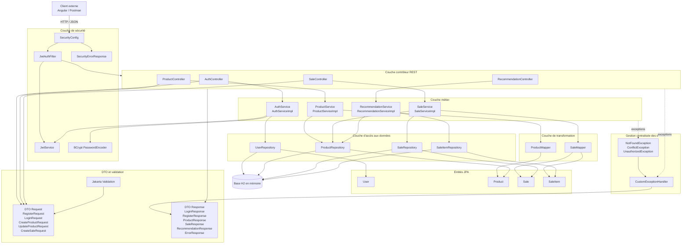
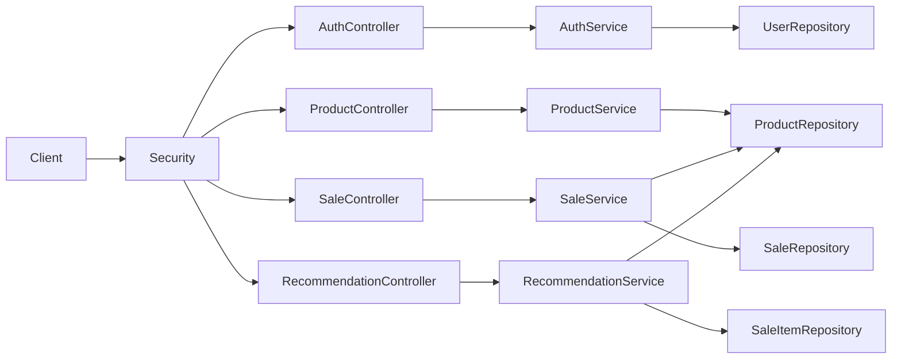
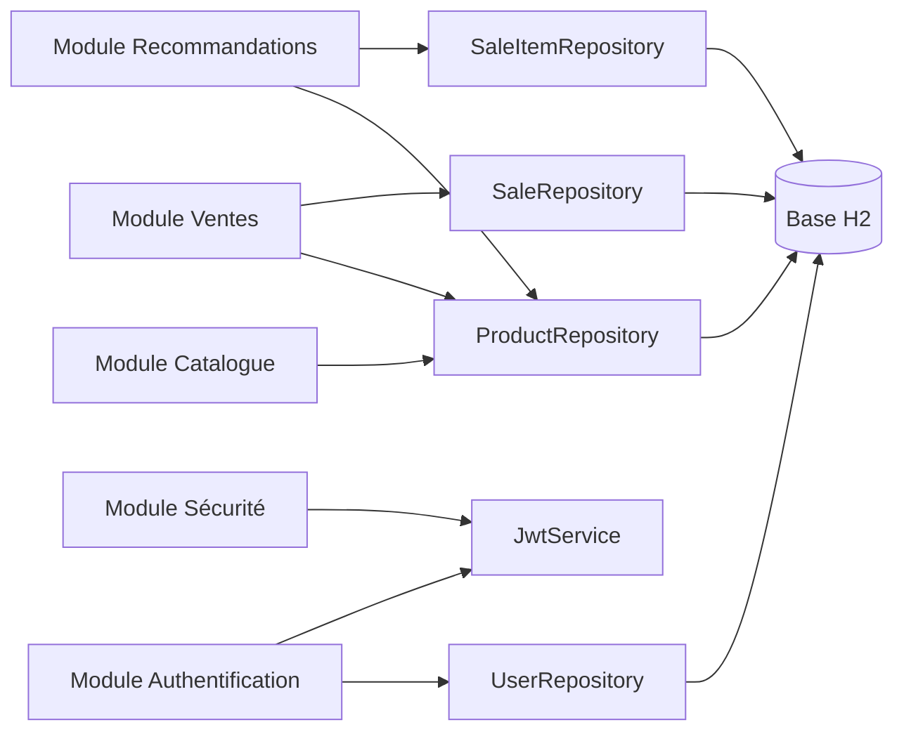
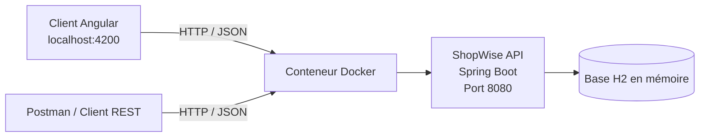
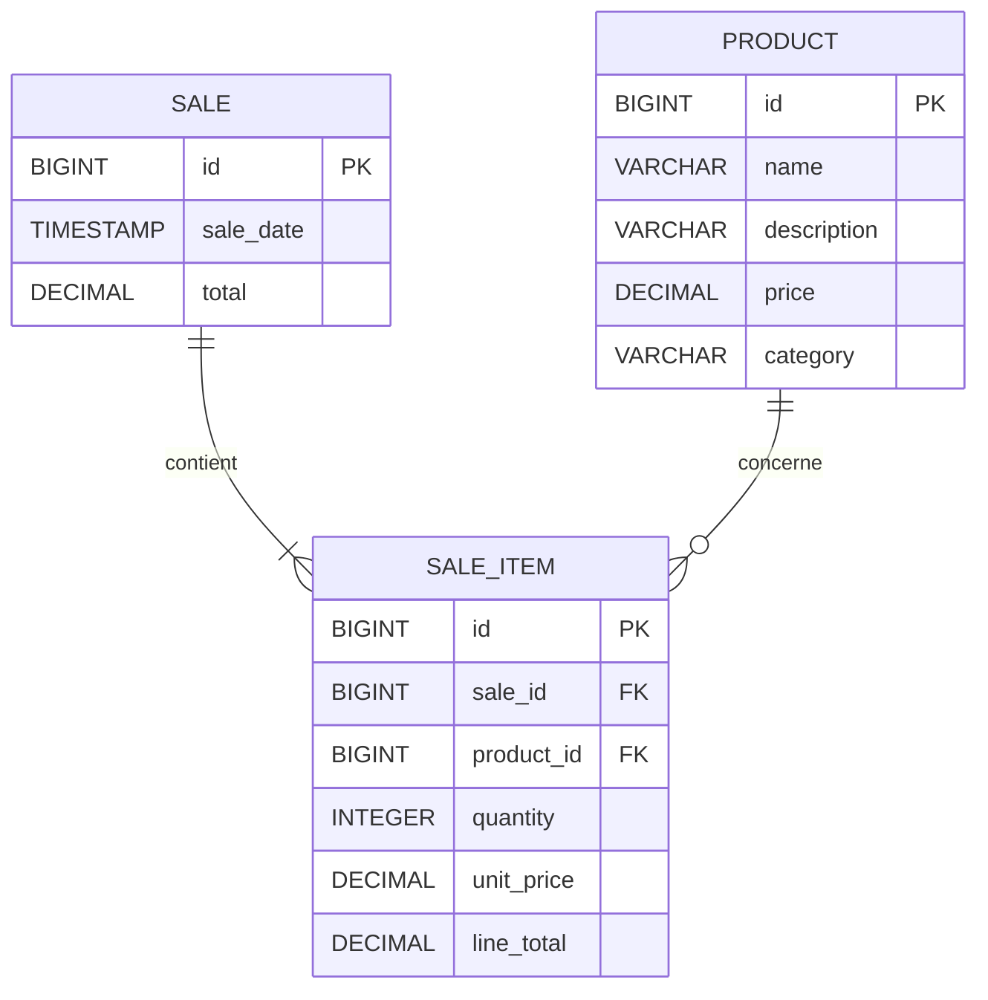
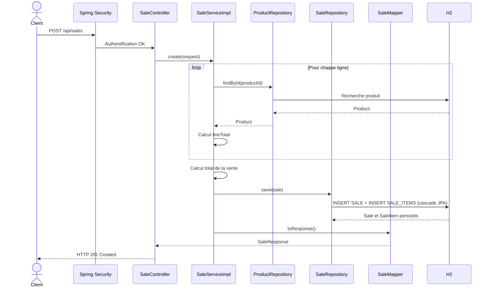

# ShopWise API

# Table des matières

- Présentation
- Guide de lancement de l'application
- Scénario de validation des API
- Question 1 - Architecture du logiciel
- Question 2 - Évolution du logiciel : module Vente
- Question 3 - Amélioration de la qualité du logiciel
- Question 4 - Intégration du Machine Learning
- Question 5 - Vérification de la qualité logicielle
- Pistes d'amélioration
- Conclusion

---

# Présentation

ShopWise est une API REST développée avec **Java 21 et Spring Boot** permettant de gérer :

- un catalogue de produits ;
- des utilisateurs authentifiés par JWT ;
- des ventes composées de plusieurs produits ;
- un système de recommandations basé sur les caractéristiques des produits et leur historique de ventes.

L’application expose des endpoints HTTP consommables par un client Angular, Postman ou tout autre client REST.


---

# Guide de lancement de l'application

Cette section montre comment récupérer le projet et lancer l'application avec Docker.

## 1. Récupérer le projet

Cloner le repository GitHub :

```bash
git clone https://github.com/fatimabenn99/shopwise.git
```

Accéder au dossier du projet :

```bash
cd shopwise
```

### Configuration

Avant de lancer l'application, il est nécessaire de renseigner une clé JWT dans les fichiers `application.properties` et `application-test.properties`.

Exemple de configuration :

```properties
security.jwt.secret=example-jwt-secret-key-change-me
```

---

## 2. Lancer l'application avec Docker

Construire l'image Docker :

```bash
docker build -t shopwise-api .
```

Lancer le conteneur (assurez-vous que Docker Desktop est démarré avant d'exécuter cette commande) :

```bash
docker run --name shopwise-api -p 8080:8080 shopwise-api
```

L'API est ensuite accessible à l'adresse via Insomnia ou Postman :

```text
http://localhost:8080
```


La console H2 est disponible à l’adresse :

```text
http://localhost:8080/h2-console
```

Paramètres de connexion :

```text
JDBC URL : jdbc:h2:mem:shopwise
User     : sa
Password :
```

Pour vérifier que le conteneur fonctionne :

```bash
docker ps
```


Pour arrêter le conteneur :

```bash
docker stop shopwise-api
```

Pour le supprimer :

```bash
docker rm shopwise-api
```

---

# Scénario de validation des API

Cette section montre comment vérifier manuellement les principales fonctionnalités avec Postman ou Insomnia.

Les exemples présentés correspondent aux critères d'acceptation des user stories 1 à 8.


## Comptes de démonstration

L'application initialise automatiquement deux comptes de démonstration afin de faciliter les tests des fonctionnalités sécurisées.

| Utilisateur | Mot de passe | Rôle |
|-------------|--------------|------|
| `admin` | `password123` | `ROLE_ADMIN` |
| `user` | `password123` | `ROLE_USER` |

### Pourquoi les nouveaux utilisateurs obtiennent-ils `ROLE_USER` ?

Lors de l'inscription (`POST /api/auth/register`), tous les nouveaux utilisateurs reçoivent automatiquement le rôle `ROLE_USER`.

Ce choix est volontaire et correspond à une bonne pratique de sécurité : un utilisateur ne doit jamais pouvoir choisir son propre rôle lors de son inscription. Autoriser la création directe d'un compte administrateur représenterait une faille de sécurité, puisqu'un utilisateur pourrait obtenir des privilèges élevés sans contrôle.

Le rôle `ROLE_ADMIN` est réservé aux administrateurs de l'application et est attribué uniquement aux comptes créés lors de l'initialisation de la base de données.

### Comment tester les fonctionnalités administrateur ?

Pour tester les endpoints protégés réservés aux administrateurs, il suffit de s'authentifier avec le compte de démonstration `admin` :

```http
POST /api/auth/login
Content-Type: application/json
```

```json
{
  "username": "admin",
  "password": "password123"
}
```

La réponse contient un JWT qu'il faut transmettre dans l'en-tête `Authorization` :

```http
Authorization: Bearer <JWT>
```

Ce jeton permet notamment de tester les endpoints réservés à `ROLE_ADMIN`, tels que :

- `POST /api/products`
- `PUT /api/products/{id}`
- `DELETE /api/products/{id}`

Le compte `user` permet quant à lui de tester les fonctionnalités accessibles aux utilisateurs authentifiés, comme la consultation des ventes et des recommandations.

---

## Étape 1 — Authentification administrateur

### Requête

```http
POST http://localhost:8080/api/auth/login
Content-Type: application/json
```

Corps :

```json
{
    "username": "admin",
    "password": "password123"
}
```

### Résultat attendu

Statut HTTP :

```text
200 OK
```

Exemple de réponse :

```json
{
    "token": "eyJhbGciOiJIUzI1NiJ9...",
    "username": "admin",
	"role": "ROLE_ADMIN",
	"tokenType": "Bearer"
}
```

Stocker le token admin pour ROLE_ADMIN

---

## Étape 2 — Authentification utilisateur

### Requête

```http
POST http://localhost:8080/api/auth/login
Content-Type: application/json
```

Corps :

```json
{
    "username": "user",
    "password": "password123"
}
```

### Résultat attendu

Statut HTTP :

```text
200 OK
```

Exemple de réponse :

```json
{
    "token": "eyJhbGciOiJIUzI1NiJ9...",
    "username": "user",
	"role": "ROLE_USER",
	"tokenType": "Bearer"
}
```

Stocker le token user pour ROLE_USER

---

# Validation du catalogue historique

## Consulter la liste des produits

### Requête

```http
GET http://localhost:8080/api/products
```

Aucun jeton n'est nécessaire.

### Résultat attendu

```text
200 OK
```

```json
[
    {
		"category": "SMARTPHONE",
		"createdAt": "2026-07-22T21:47:10.075268",
		"description": "Apple smartphone 128GB OLED",
		"id": 1,
		"name": "iPhone 15",
		"price": 999.99,
		"updatedAt": "2026-07-22T21:47:10.075268"
	},
	{
		"category": "SMARTPHONE",
		"createdAt": "2026-07-22T21:47:10.075268",
		"description": "Apple smartphone 256GB OLED large screen",
		"id": 2,
		"name": "iPhone 15 Plus",
		"price": 1199.99,
		"updatedAt": "2026-07-22T21:47:10.075268"
	}
]
```

---

## Créer un produit en tant qu'administrateur

### Requête

```http
POST http://localhost:8080/api/products
Authorization: Bearer {{adminToken}}
Content-Type: application/json
```

Corps :

```json
{
    "name": "Produit test",
    "description": "Produit créé ",
    "price": 49.90,
    "category": "TEST"
}
```

### Résultat attendu

```text
201 Created
```

Exemple :

```json
{
	"category": "TEST",
	"createdAt": "2026-07-22T22:17:00.335998",
	"description": "Produit créé ",
	"id": 21,
	"name": "Produit test",
	"price": 49.90,
	"updatedAt": "2026-07-22T22:17:00.335998"
}
```

---

# US 1 — Enregistrer une vente

Cette vérification confirme qu'une vente peut contenir plusieurs produits, que ses montants sont calculés automatiquement et qu'elle est persistée.

## Requête

```http
POST http://localhost:8080/api/sales
Authorization: Bearer {{adminToken}}
Content-Type: application/json
```

Corps à copier :

```json
{
    "items": [
        {
            "productId": 1,
            "quantity": 2
        },
        {
            "productId": 2,
            "quantity": 1
        }
    ]
}
```

## Résultat attendu

```text
201 Created
```

Exemple de réponse :

```json
{
	"id": 16,
	"items": [
		{
			"lineTotal": 1999.98,
			"productId": 1,
			"productName": "iPhone 15",
			"quantity": 2,
			"unitPrice": 999.99
		},
		{
			"lineTotal": 1199.99,
			"productId": 2,
			"productName": "iPhone 15 Plus",
			"quantity": 1,
			"unitPrice": 1199.99
		}
	],
	"saleDate": "2026-07-22T22:29:59.804268",
	"total": 3199.97
}
```

Vérifications :

- la vente possède un identifiant ;
- deux lignes de vente sont présentes ;
- les prix proviennent du catalogue ;
- chaque `lineTotal` correspond à `quantity × unitPrice` ;
- le champ `total` correspond à la somme `lineTotal` de ventes.

---

# US 2 — Consulter la liste des ventes

## Requête

```http
GET http://localhost:8080/api/sales
Authorization: Bearer {{adminToken}}
```

## Résultat attendu

```text
200 OK
```

Exemple :

```json
[
    {
		"id": 1,
		"items": [
			{
				"lineTotal": 999.99,
				"productId": 1,
				"productName": "iPhone 15",
				"quantity": 1,
				"unitPrice": 999.99
			},
			{
				"lineTotal": 279.99,
				"productId": 13,
				"productName": "AirPods Pro",
				"quantity": 1,
				"unitPrice": 279.99
			},
			{
				"lineTotal": 499.99,
				"productId": 17,
				"productName": "Apple Watch Series 10",
				"quantity": 1,
				"unitPrice": 499.99
			}
		],
		"saleDate": "2026-07-22T22:29:57.128767",
		"total": 1779.97
	},
    ....
]
```

Vérifications :

- toutes les ventes sont retournées ;
- chaque vente contient ses informations principales ;
- la vente créée précédemment apparaît dans la liste ;
- les ventes sont triées de la plus récente à la plus ancienne.

---

# US 3 — Consulter le détail d'une vente

## Requête

```http
GET http://localhost:8080/api/sales/16
Authorization: Bearer {{adminToken}}
```


## Résultat attendu

```text
200 OK
```

Exemple :

```json
{
	"id": 16,
	"items": [
		{
			"lineTotal": 1999.98,
			"productId": 1,
			"productName": "iPhone 15",
			"quantity": 2,
			"unitPrice": 999.99
		},
		{
			"lineTotal": 1199.99,
			"productId": 2,
			"productName": "iPhone 15 Plus",
			"quantity": 1,
			"unitPrice": 1199.99
		}
	],
	"saleDate": "2026-07-22T22:29:59.804268",
	"total": 3199.97
}
```

La réponse doit contenir :

- les produits ;
- les quantités ;
- les prix unitaires ;
- les montants de chaque produit ;
- le montant total de la vente.

---

## US 3 et US 6 — Vente inexistante

### Requête

```http
GET http://localhost:8080/api/sales/999999
Authorization: Bearer {{adminToken}}
```

### Résultat attendu

```text
404 Not Found
```

Exemple :

```json
{
	"code": 404,
	"message": "Sale not found",
	"timestamp": "2026-07-22T22:38:25.8910116"
}
```


---

# US 4 — Vérifier les autorisations

La création de produits est réservée au rôle `ROLE_ADMIN`.

## Tentative avec un utilisateur non administrateur

### Requête

```http
POST http://localhost:8080/api/products
Authorization: Bearer {{userToken}}
Content-Type: application/json
```

Corps :

```json
{
    "name": "Produit interdit",
    "description": "Cette création doit être refusée",
    "price": 20.00,
    "category": "TEST"
}
```

### Résultat attendu

```text
403 Forbidden
```

Exemple :

```json
{
	"code": 403,
	"message": "Access denied",
	"timestamp": "2026-07-22T22:42:02.735237400"
}
```

Vérification :

- le produit n'est pas créé ;
- le statut HTTP est `403` ;
- la réponse contient un message explicite.

---

# US 5 — Vérifier l'authentification JWT

## Requête protégée sans jeton

### Requête

```http
GET http://localhost:8080/api/sales
```

Ne pas renseigner l'en-tête `Authorization`.

### Résultat attendu

```text
401 Unauthorized
```

Exemple :

```json
{
	"code": 401,
	"message": "Authentication required",
	"timestamp": "2026-07-22T22:42:57.298399700"
}
```

---

## Requête protégée avec un jeton invalide

### Requête

```http
GET http://localhost:8080/api/sales
Authorization: Bearer token-invalide
```

### Résultat attendu

```text
401 Unauthorized
```

Exemple :

```json
{
	"code": 401,
	"message": "Invalid or expired token",
	"timestamp": "2026-07-22T22:43:20.209874300"
}
```

---

# US 6 — Vérifier les erreurs normalisées

## Requête invalide : quantité négative

### Requête

```http
POST http://localhost:8080/api/sales
Authorization: Bearer {{adminToken}}
Content-Type: application/json
```

Corps :

```json
{
    "items": [
        {
            "productId": 1,
            "quantity": -2
        }
    ]
}
```

### Résultat attendu

```text
400 Bad Request
```

Exemple :

```json
{
	"code": 400,
	"message": "items[0].quantity: doit être supérieur à 0",
	"timestamp": "2026-07-22T22:44:01.112988"
}
```

---

## Requête invalide : liste de produits vide

### Requête

```http
POST http://localhost:8080/api/sales
Authorization: Bearer {{adminToken}}
Content-Type: application/json
```

Corps :

```json
{
    "items": []
}
```

### Résultat attendu

```text
400 Bad Request
```

La réponse doit respecter le format d'erreur normalisé :

```json
{
	"code": 400,
	"message": "items: ne doit pas être vide",
	"timestamp": "2026-07-22T22:44:41.1015407"
}
```

---

## Produit inexistant dans une vente

### Requête

```http
POST http://localhost:8080/api/sales
Authorization: Bearer {{adminToken}}
Content-Type: application/json
```

Corps :

```json
{
    "items": [
        {
            "productId": 999999,
            "quantity": 1
        }
    ]
}
```

### Résultat attendu

```text
404 Not Found
```

Exemple :

```json
{
	"code": 404,
	"message": "Product not found",
	"timestamp": "2026-07-22T22:45:02.9966869"
}
```

---

# US 7 — Obtenir des recommandations

Cette requête utilise le catalogue et l'historique des ventes pour proposer des produits proches d'un produit cible.

## Requête

```http
GET http://localhost:8080/api/recommendations/products/1
Authorization: Bearer {{adminToken}}
```

L'identifiant `1` peut être remplacé par l'identifiant d'un produit retourné par :

```http
GET http://localhost:8080/api/products
```

## Résultat attendu

```text
200 OK
```

Exemple :

```json
[
	{
		"productId": 2,
		"productName": "iPhone 15 Plus",
		"price": 1199.99,
		"similarityScore": 0.8333,
		"reason": "Produit souvent acheté avec le produit consulté"
	},
	{
		"productId": 3,
		"productName": "iPhone 15 Pro",
		"price": 1399.99,
		"similarityScore": 0.717,
		"reason": "Produit proche selon le KNN : même catégorie et caractéristiques similaires"
	},
	{
		"productId": 6,
		"productName": "Google Pixel 9",
		"price": 949.99,
		"similarityScore": 0.7009,
		"reason": "Produit proche selon le KNN : même catégorie"
	},
	{
		"productId": 4,
		"productName": "Samsung Galaxy S24",
		"price": 899.99,
		"similarityScore": 0.6944,
		"reason": "Produit proche selon le KNN : même catégorie"
	},
	{
		"productId": 7,
		"productName": "Xiaomi 14",
		"price": 849.99,
		"similarityScore": 0.6912,
		"reason": "Produit proche selon le KNN : même catégorie"
	}
]
```

Vérifications :

- le produit cible n'est pas recommandé à lui-même ;
- les résultats proviennent du catalogue ;
- les recommandations sont ordonnées par score `similarityScore` décroissant ;
- au maximum cinq produits sont retournés ;
- le score prend en compte les caractéristiques des produits et les ventes associées.

---

## Produit cible inexistant

### Requête

```http
GET http://localhost:8080/api/recommendations/products/999999
Authorization: Bearer {{adminToken}}
```

### Résultat attendu

```text
404 Not Found
```

Exemple :

```json
{
	"code": 404,
	"message": "Product not found",
	"timestamp": "2026-07-22T22:47:08.9568141"
}
```


# Récapitulatif des validations manuelles

| User story | Vérification | Résultat attendu |
|---|---|---|
| US 1 | Création d'une vente avec plusieurs produits | `201 Created` |
| US 2 | Consultation de toutes les ventes | `200 OK`, tri décroissant |
| US 3 | Consultation du détail d'une vente | `200 OK` |
| US 3 | Consultation d'une vente inexistante | `404 Not Found` |
| US 4 | Création d'un produit avec `ROLE_USER` | `403 Forbidden` |
| US 5 | Route protégée sans JWT | `401 Unauthorized` |
| US 5 | Route protégée avec JWT invalide | `401 Unauthorized` |
| US 6 | Requête métier invalide | `400 Bad Request` |
| US 6 | Ressource inexistante | `404 Not Found` |
| US 7 | Récupération des recommandations | `200 OK` |
| US 8 | Vérification de l'isolation du module | Architecture modulaire |


---

# Question 1 - Architecture du logiciel

## Principe général

ShopWise repose sur une architecture en couches permettant de séparer clairement les responsabilités de chaque composant. Cette organisation favorise la maintenabilité, limite le couplage entre les différentes parties de l'application et facilite l'ajout de nouvelles fonctionnalités sans remettre en cause l'architecture existante.

Chaque couche possède une responsabilité précise :

| Couche | Responsabilité |
|---|---|
| Sécurité | Authentification JWT et autorisation selon les rôles |
| Contrôleurs | Exposition des endpoints REST et gestion des requêtes HTTP |
| DTO | Définition des données reçues et retournées par l’API |
| Services | Application des règles métier |
| Mappers | Conversion entre les DTO et les entités |
| Repositories | Accès aux données avec Spring Data JPA |
| Entités | Représentation du modèle de données persistant |
| Gestion des erreurs | Transformation des exceptions en réponses HTTP homogènes |
| Base de données | Persistance des utilisateurs, produits, ventes et lignes de vente |

Cette séparation réduit les dépendances entre les couches et facilite l'évolution de l'application.

## Diagramme de composants

Le diagramme suivant représente l’architecture générale de ShopWise et les principales dépendances entre ses composants.



## Responsabilités des modules

### Module Sécurité

Le module Sécurité regroupe les composants suivants :

```text
SecurityConfig
JwtAuthFilter
JwtService
SecurityErrorResponse
PasswordEncoder
```

Il est responsable :

- de l'authentification des utilisateurs ;
- de la validation des jetons JWT ;
- du contrôle des autorisations selon les rôles ;
- de la protection des endpoints de l'API ;
- de la sécurisation des mots de passe.

---

### Module Authentification

Le module Authentification est composé de :

```text
AuthController
AuthService
AuthServiceImpl
UserRepository
User
JwtService
PasswordEncoder
```

Il est responsable :

- de l'inscription des utilisateurs ;
- de l'authentification ;
- de la gestion des comptes utilisateurs ;
- de la génération des jetons JWT après une authentification réussie.

---

### Module Catalogue

Le module Catalogue comprend :

```text
ProductController
ProductService
ProductServiceImpl
ProductMapper
ProductRepository
Product
```

Il est responsable :

- de la gestion du catalogue de produits ;
- de la création, de la consultation, de la modification et de la suppression des produits ;
- de la mise à disposition des données produits utilisées par les autres modules de l'application.

---

### Module Vente

Le module Vente comprend :

```text
SaleController
SaleService
SaleServiceImpl
SaleMapper
SaleRepository
ProductRepository
Sale
SaleItem
```

Il est responsable :

- de la gestion des ventes ;
- de la création et de la consultation des ventes ;
- de la gestion des lignes de vente ;
- de l'interaction avec le catalogue afin d'exploiter les informations des produits lors d'une vente.

---

### Module Recommandation

Le module Recommandation comprend :

```text
RecommendationController
RecommendationService
RecommendationServiceImpl
ProductRepository
SaleItemRepository
RecommendationResponse
```

Il est responsable de la génération de recommandations de produits à partir des informations du catalogue et de l'historique des ventes.

L'utilisation de l'interface `RecommendationService` permet de faire évoluer l'algorithme de recommandation sans modifier les autres couches de l'application.

---

## Interactions entre les modules

Les contrôleurs reçoivent les requêtes HTTP puis délèguent les traitements aux services. Les services appliquent les règles métier et utilisent les repositories pour accéder aux données persistées.



Ce flux met en évidence les interactions entre les différents modules tout en conservant une séparation claire des responsabilités.

---

## Dépendances entre les modules métier



Le catalogue est partagé avec les ventes et les recommandations :

- le module ventes utilise les produits pour récupérer leur prix ;
- le module recommandations utilise les produits comme candidats ;
- le module recommandations utilise les lignes de vente pour déterminer les achats associés.


## Architecture de déploiement

Le diagramme suivant présente l'architecture de déploiement de ShopWise. L'application est conteneurisée avec Docker et expose une API REST Spring Boot accessible par différents clients HTTP, tels qu'une application Angular ou un outil de test comme Postman. Les données sont stockées dans une base H2 embarquée utilisée pour le développement et les démonstrations.



Cette architecture facilite le déploiement de l'application en garantissant un environnement d'exécution reproductible grâce à Docker. La séparation entre le client, l'API et la base de données permet également de faire évoluer chaque composant de manière indépendante.

---

## Justification des choix d’architecture

### Évolutivité

L'utilisation d'une architecture en couches permet de faire évoluer chaque module indépendamment. Les contrôleurs s'appuient sur des interfaces de services, ce qui facilite le remplacement d'une implémentation sans impacter les autres composants.

Cette organisation simplifie notamment l'ajout de nouvelles fonctionnalités ou l'évolution du moteur de recommandation.

---

### Robustesse

L'architecture en couches renforce la robustesse de l'application en séparant clairement les responsabilités entre les composants. Les contrôleurs, les services, les repositories et le module de sécurité sont indépendants les uns des autres, ce qui limite les impacts d'une évolution ou d'une anomalie sur le reste du système.

Cette organisation permet également d'assurer la cohérence des traitements métier tout en facilitant la gestion des erreurs et la sécurisation des accès.

---

### Testabilité

Chaque couche pouvant être isolée, les composants peuvent être testés indépendamment.

Cette architecture facilite la mise en œuvre de tests unitaires, de tests d'intégration et de tests API.

---

### Maintenabilité

Chaque couche possède une responsabilité limitée et identifiable.

| Composant | Responsabilité |
|---|---|
| Contrôleur | Gérer les requêtes et réponses HTTP |
| Service | Appliquer les règles métier |
| Mapper | Transformer les DTO et les entités |
| Repository | Accéder aux données |
| Entité | Représenter les données persistantes |
| DTO | Définir le contrat HTTP |
| Sécurité | Authentifier et autoriser |
| Exception handler | Uniformiser les erreurs |

Cette organisation :

- réduit la duplication ;
- rend le code plus lisible ;
- simplifie la recherche d’erreurs ;
- facilite l’ajout de nouvelles fonctionnalités ;
- limite les impacts d’une modification.

---

# Question 2 - Évolution du logiciel : module Vente

## Analyse de la base de code existante

La version initiale de ShopWise permettait uniquement la gestion d'un catalogue de produits. L'application était déjà organisée selon une architecture en couches composée de contrôleurs, services, repositories, DTO, mappers et entités.

Cette organisation a permis d'ajouter un nouveau module sans remettre en cause les fonctionnalités existantes.

L'analyse des user stories a conduit aux besoins suivants :

- créer une vente contenant une ou plusieurs lignes de vente ;
- associer chaque ligne à un produit existant ;
- enregistrer la quantité achetée pour chaque produit ;
- récupérer automatiquement le prix du produit depuis le catalogue ;
- calculer le montant de chaque ligne ;
- calculer automatiquement le montant total de la vente ;
- consulter une vente par son identifiant ;
- consulter l'ensemble des ventes ;
- protéger les endpoints grâce à Spring Security et JWT.

Le module Vente réutilise directement le module Catalogue via `ProductRepository`. Cette dépendance permet de vérifier qu'un produit existe avant de créer une vente et garantit que le prix utilisé correspond au prix enregistré dans le catalogue.

---

## Intégration dans l’architecture

Le module Vente s’intègre à l’architecture existante en réutilisant les couches et conventions déjà présentes. Ses dépendances sont limitées aux composants nécessaires à la gestion des ventes et à la consultation du catalogue.

```text
SaleController
    ↓
SaleService
    ↓
SaleServiceImpl
    ├── ProductRepository
    ├── SaleRepository
    └── SaleMapper
            ↓
         Base H2
```

Les responsabilités sont réparties comme suit :

| Composant | Responsabilité |
|-----------|----------------|
| SaleController | Exposer les endpoints REST du module Vente |
| SaleService | Définir le contrat métier |
| SaleServiceImpl | Implémenter les règles métier |
| ProductRepository | Vérifier l'existence des produits et récupérer leur prix |
| SaleRepository | Persister les ventes |
| SaleMapper | Convertir les entités vers les DTO |
| Sale | Représenter une vente |
| SaleItem | Représenter une ligne de vente |

Les lignes de vente ne sont pas enregistrées directement par `SaleItemRepository`. Elles sont associées à la vente grâce à la méthode `addItem()` de l'entité `Sale`, puis automatiquement persistées lors de l'enregistrement de la vente via `SaleRepository`. Cette persistance est assurée par la relation `OneToMany` configurée avec `CascadeType.ALL`, ce qui garantit la cohérence entre une vente et ses lignes.

---

## Modèle de données

Le module Vente repose sur deux nouvelles entités :

- `Sale` : représente une vente ;
- `SaleItem` : représente une ligne de vente.

Une vente contient une ou plusieurs lignes. Chaque ligne référence un produit existant.



### Entité Sale

Une vente possède :

| Champ | Description |
|-------|-------------|
| id | identifiant unique |
| saleDate | date de création |
| total | montant total de la vente |
| items | liste des lignes de vente |

Une vente est liée à plusieurs lignes (`OneToMany`).

---

### Entité SaleItem

Chaque ligne de vente possède :

| Champ | Description |
|-------|-------------|
| id | identifiant unique |
| sale | vente associée |
| product | produit vendu |
| quantity | quantité achetée |
| unitPrice | prix unitaire enregistré lors de la vente |
| lineTotal | montant total de la ligne |

Le prix unitaire est conservé dans `SaleItem` afin de préserver le prix réellement appliqué lors de l'achat, même si le prix du produit évolue par la suite.

Le calcul est réalisé automatiquement :

```text
lineTotal = unitPrice × quantity
```

Le montant total d'une vente correspond à la somme des montants de toutes les lignes.

---

## Flux de création d'une vente



Le diagramme ci-dessus illustre le déroulement complet de la création d'une vente.

1. Le client envoie une requête `POST /api/sales` contenant la liste des produits et leurs quantités.

2. Spring Security vérifie l'authentification de l'utilisateur grâce au jeton JWT. Si l'utilisateur est autorisé, la requête est transmise au `SaleController`.

3. Le contrôleur délègue le traitement au `SaleServiceImpl`, qui applique l'ensemble des règles métier.

4. Pour chaque ligne de vente, le service interroge `ProductRepository` afin de vérifier que le produit existe et de récupérer son prix enregistré dans le catalogue. Le montant de chaque ligne (`lineTotal`) est ensuite calculé à partir du prix unitaire et de la quantité demandée.

5. Une fois toutes les lignes traitées, le service calcule automatiquement le montant total de la vente en additionnant les montants de chaque ligne.

6. La vente est enregistrée dans la base H2 via `SaleRepository`. Les lignes de vente (`SaleItem`) sont persistées en même temps grâce à la relation définie entre les entités.

7. Enfin, `SaleMapper` convertit l'entité `Sale` en `SaleResponse`, qui est renvoyée au client avec le statut HTTP `201 Created`.

La méthode de création est transactionnelle. Ainsi, si un produit demandé n'existe pas ou si une erreur survient pendant le traitement, une exception est levée et l'ensemble de la transaction est annulé. Cette approche garantit la cohérence des données en évitant l'enregistrement de ventes incomplètes ou incohérentes.

---

## API Vente

Le module Vente expose les endpoints suivants :

| Méthode | Endpoint | Description | Accès |
|---------|----------|-------------|--------|
| GET | `/api/sales` | Liste des ventes | ROLE_USER / ROLE_ADMIN |
| GET | `/api/sales/{id}` | Détail d'une vente | ROLE_USER / ROLE_ADMIN |
| POST | `/api/sales` | Création d'une vente | ROLE_USER / ROLE_ADMIN |

### Exemple de création

```json
{
    "items": [
        {
            "productId": 1,
            "quantity": 2
        },
        {
            "productId": 2,
            "quantity": 1
        }
    ]
}
```

Lors de la création d'une vente, le backend :

1. valide les données reçues ;
2. recherche chaque produit dans le catalogue ;
3. récupère son prix actuel ;
4. calcule automatiquement le total de chaque ligne ;
5. calcule le montant total de la vente ;
6. enregistre la vente et ses lignes ;
7. retourne une `SaleResponse`.

Les ventes sont retournées de la plus récente à la plus ancienne.

## Pérennité et évolutivité du module

Le module Vente reprend les conventions de l’application existante : séparation entre contrôleur, service, repository, mapper, DTO et entités. Cette homogénéité facilite sa compréhension et sa reprise par un autre développeur.

L’interface `SaleService` sépare le contrat métier de son implémentation, conformément au principe d’inversion des dépendances. Chaque composant conserve une responsabilité précise : le contrôleur gère les échanges HTTP, le service applique les règles métier et les repositories assurent la persistance.

L’utilisation de DTO évite d’exposer directement les entités JPA, tandis que le stockage du prix dans `SaleItem` préserve l’historique des ventes si le prix du produit évolue. Le modèle peut également être étendu ultérieurement pour associer une vente à un utilisateur, un commerce ou un moyen de paiement sans remettre en cause le fonctionnement actuel.

---

## Synthèse

Le module Vente a été intégré à l’architecture existante en respectant les principes de séparation des responsabilités.

Cette évolution comprend :

- un nouveau modèle de données composé des entités `Sale` et `SaleItem` ;
- une API REST permettant de créer et de consulter les ventes ;
- une logique métier transactionnelle assurant le calcul et la cohérence des montants ;
- une persistance avec Spring Data JPA ;
- une intégration maîtrisée avec le catalogue de produits ;
- une conception favorisant la maintenabilité et les évolutions futures.

La sécurisation, la gestion détaillée des erreurs et la stratégie de tests sont présentées respectivement dans les Questions 3 et 5.

---

# Question 3 - Amélioration de la qualité du logiciel : sécurisation de l'API

## Analyse des besoins

L'analyse des user stories 4 à 6 met en évidence plusieurs exigences de sécurité :

- empêcher un utilisateur non authentifié d'accéder aux fonctionnalités protégées ;
- limiter certaines opérations aux administrateurs ;
- garantir que seules les personnes autorisées puissent modifier les données ;
- fournir des réponses d'erreur cohérentes et compréhensibles.

Afin de répondre à ces exigences, l'API a été sécurisée avec Spring Security et un mécanisme d'authentification par jeton JWT.

---

## Identification des opérations sensibles

L'analyse des endpoints montre que toutes les opérations ne présentent pas le même niveau de sensibilité.

Les opérations de consultation du catalogue sont publiques, tandis que les opérations modifiant les données ou donnant accès à des informations réservées nécessitent une authentification.

| Endpoint | Niveau d'accès |
|----------|----------------|
| POST `/api/auth/register` | Public |
| POST `/api/auth/login` | Public |
| GET `/api/products` | Public |
| GET `/api/products/{id}` | Public |
| POST `/api/products` | ROLE_ADMIN |
| PUT `/api/products/{id}` | ROLE_ADMIN |
| DELETE `/api/products/{id}` | ROLE_ADMIN |
| GET `/api/sales` | ROLE_USER / ROLE_ADMIN |
| GET `/api/sales/{id}` | ROLE_USER / ROLE_ADMIN |
| POST `/api/sales` | ROLE_USER / ROLE_ADMIN |
| GET `/api/recommendations/**` | ROLE_USER / ROLE_ADMIN |

Cette séparation permet de protéger les ressources sensibles tout en conservant un accès public au catalogue.

---

## Authentification et autorisation

L'authentification repose sur Spring Security associé à des jetons JWT.

Après une connexion réussie :

1. l'utilisateur s'authentifie via `/api/auth/login` ;
2. un jeton JWT est généré ;
3. le client transmet ce jeton dans l'en-tête :

```text
Authorization: Bearer <token>
```

À chaque requête protégée :

- `JwtAuthFilter` extrait le jeton ;
- `JwtService` vérifie sa signature et sa date d'expiration ;
- si le jeton est valide, l'utilisateur est authentifié dans Spring Security ;
- Spring Security vérifie ensuite que le rôle de l'utilisateur autorise l'accès à la ressource demandée.

Deux rôles sont utilisés :

- `ROLE_USER`
- `ROLE_ADMIN`

Les opérations d'administration du catalogue sont réservées aux administrateurs, tandis que les ventes et les recommandations sont accessibles à tous les utilisateurs authentifiés.

---

## Normalisation des réponses d'erreur

Les réponses d'erreur sont normalisées grâce à `CustomExceptionHandler` pour les exceptions applicatives et à `SecurityErrorResponse` pour les erreurs liées à Spring Security.

Les principaux codes HTTP utilisés sont les suivants :

| Situation | Code HTTP |
|-----------|-----------|
| Requête invalide | 400 Bad Request |
| Authentification requise | 401 Unauthorized |
| Accès interdit | 403 Forbidden |
| Ressource inexistante | 404 Not Found |
| Conflit métier | 409 Conflict |
| Erreur interne | 500 Internal Server Error |

Toutes les erreurs utilisent le même format JSON :

```json
{
    "code": 404,
    "message": "Product not found",
    "timestamp": "2026-01-01T10:00:00"
}
```

Cette normalisation facilite le traitement des erreurs par les clients de l'API.

---

## Justification des choix techniques

Afin de répondre aux exigences de sécurité des user stories 4 à 6, plusieurs choix techniques ont été retenus. Chaque choix est justifié par les besoins de sécurisation de l'API.

- **Spring Security** a été choisi car il constitue le framework de référence de l'écosystème Spring pour la sécurisation des applications. Son intégration native avec Spring Boot permet de mettre en place un mécanisme d'authentification et d'autorisation robuste tout en limitant le développement de composants de sécurité spécifiques.

- **JWT (JSON Web Token)** a été retenu afin de mettre en œuvre une authentification stateless. Ce choix évite de conserver une session côté serveur : chaque requête transporte un jeton signé permettant de vérifier l'identité de l'utilisateur, ce qui est particulièrement adapté à une API REST.

- **BCrypt** a été choisi pour protéger les mots de passe en les stockant sous forme de hash plutôt qu'en clair. Ce choix renforce la sécurité des comptes utilisateurs en cas d'accès non autorisé à la base de données.

- **Le contrôle d'accès par rôles (`ROLE_USER` et `ROLE_ADMIN`)** a été retenu afin d'appliquer le principe du moindre privilège. Ce choix permet de réserver les opérations sensibles, comme la gestion du catalogue, aux administrateurs, tout en laissant les fonctionnalités autorisées accessibles aux utilisateurs authentifiés.

- **La gestion centralisée des erreurs** a été mise en place afin de garantir des réponses HTTP homogènes sur l'ensemble de l'API. Ce choix facilite le traitement des erreurs par les clients et améliore la maintenabilité en évitant de dupliquer leur gestion dans chaque contrôleur.

- **Jakarta Validation** a été choisi afin de valider automatiquement les données reçues avant l'exécution de la logique métier. Ce choix permet de rejeter les requêtes invalides dès leur réception, garantissant ainsi la cohérence des données et la robustesse de l'application.

Ces choix techniques répondent aux exigences de sécurité identifiées lors de l'analyse des user stories et permettent de sécuriser l'API tout en conservant une architecture maintenable, évolutive et conforme aux bonnes pratiques de développement avec Spring Boot.

---

# Question 4 - Intégration du Machine Learning

## Analyse des besoins

L'analyse des user stories 7 et 8 montre que l'application doit proposer des recommandations personnalisées afin d'aider l'utilisateur à découvrir des produits proches de celui qu'il consulte.

Les recommandations doivent :

- exploiter le catalogue existant ;
- prendre en compte les ventes déjà enregistrées ;
- retourner des produits similaires ;
- favoriser les produits souvent achetés ensemble ;
- être disponibles directement via l'API REST.

Le module de recommandation repose donc sur deux sources de données :

- le catalogue de produits (`Product`) ;
- l'historique des ventes (`Sale` et `SaleItem`).

L'objectif n'est pas de proposer un classement des meilleures ventes ("best-sellers"), mais de recommander les produits les plus proches d'un produit cible selon leurs caractéristiques et le comportement d'achat observé.

Le module expose également un point d'accès REST permettant de récupérer les recommandations calculées à partir de ces données.

---

## Algorithme de recommandation

Le module de recommandation implémente une approche de **Machine Learning inspirée de l'algorithme des K plus proches voisins (KNN)**.

Contrairement à un modèle entraîné sur un jeu de données externe, les recommandations sont calculées dynamiquement à partir des informations disponibles dans le catalogue et de l'historique des ventes.

Pour un produit cible :

1. le produit demandé est récupéré depuis le catalogue;
2. tous les autres produits sont considérés comme candidats;
3. plusieurs mesures de similarité et de distance sont calculées entre le produit cible et chaque candidat;
4. ces distances sont combinées en une distance globale pondérée;
5. cette distance est convertie en un score de similarité;
6. les candidats sont triés selon leur score de similarité;
7. les cinq produits les plus pertinents sont retournés.

Le calcul de la distance globale repose sur plusieurs critères pondérés :

| Critère | Poids |
|---|---:|
| Catégorie | 35 % |
| Similarité textuelle | 30 % |
| Proximité du prix | 20 % |
| Cooccurrences dans les ventes | 15 % |

Chaque critère produit une distance comprise entre 0 et 1. La distance globale est obtenue en appliquant les pondérations ci-dessus, ce qui permet de prendre en compte simultanément les caractéristiques des produits et les comportements d'achat observés.

La similarité textuelle est calculée à partir des informations suivantes :

- le nom du produit ;
- la description ;
- la catégorie.

Les mots peu significatifs sont ignorés grâce à une liste de mots vides afin d'améliorer la pertinence de la comparaison.

La proximité commerciale est déterminée à partir des produits apparaissant ensemble dans une même vente, ce qui permet de prendre en compte le comportement d'achat des utilisateurs.

Une fois la distance globale calculée, celle-ci est transformée en un score de similarité compris entre 0 et 1. Plus ce score est élevé, plus le produit est considéré comme proche du produit cible. Les recommandations sont ensuite classées par ordre décroissant de ce score.

Les recommandations sont accessibles via le point d'accès :

```text
GET /api/recommendations/products/{productId}
```

Cet endpoint reçoit l'identifiant d'un produit et retourne les recommandations calculées par le moteur de recommandation sous forme de réponse JSON.

---

# Question 5 - Vérification de la qualité logicielle

## Stratégie de tests

Afin de garantir la qualité du logiciel, une stratégie de tests progressive a été mise en place. Son objectif est de détecter les erreurs le plus tôt possible, de vérifier le bon fonctionnement des composants lorsqu'ils interagissent entre eux et de s'assurer que les évolutions apportées au projet n'ont pas dégradé les fonctionnalités existantes.

Cette stratégie couvre les fonctionnalités historiques du catalogue ainsi que les nouveaux modules développés :

- le catalogue de produits ;
- le module Vente ;
- l'authentification ;
- l'autorisation par JWT ;
- le module de recommandation ;
- la validation des données ;
- la gestion des erreurs.

Les tests unitaires, d'intégration et API sont réalisés sur l'ensemble des fonctionnalités. Les tests de non-régression sont quant à eux spécifiquement dédiés à la vérification du maintien du bon fonctionnement des fonctionnalités historiques.

Les tests sont organisés selon quatre niveaux complémentaires.

| Niveau | Objectif | Outils |
|---|---|---|
| Tests unitaires | Vérifier le comportement d'un composant de manière isolée | JUnit 5, Mockito |
| Tests d'intégration | Vérifier les interactions entre les services, les repositories et la base de données | Spring Boot Test, H2 |
| Tests API | Vérifier les endpoints REST, la sécurité, la validation des requêtes et les réponses HTTP | MockMvc |
| Tests de non-régression | Vérifier que les évolutions du projet n'ont pas modifié le comportement des fonctionnalités historiques | JUnit 5, Spring Boot Test, MockMvc |

Les tests sont exécutés selon la progression suivante :

```text
Tests unitaires
      ↓
Tests d'intégration
      ↓
Tests API
      ↓
Tests de non-régression
```

Cette organisation permet :

- de valider la logique métier de chaque composant indépendamment ;
- de vérifier les interactions entre les composants et la persistance des données ;
- de contrôler le comportement observable de l'API (statuts HTTP, réponses JSON, sécurité et validation) ;
- de garantir que les évolutions apportées au projet n'ont pas modifié le fonctionnement des fonctionnalités historiques.

---

## Couverture fonctionnelle

La stratégie de tests couvre les fonctionnalités historiques ainsi que les nouveaux modules développés.

| Fonctionnalité | Tests unitaires | Tests d'intégration | Tests API | Tests de non-régression |
|---|:---:|:---:|:---:|:---:|
| Catalogue produits | ✓ | ✓ | ✓ | ✓ |
| Authentification | ✓ | ✓ | ✓ | — |
| Autorisation (JWT) | ✓ | ✓ | ✓ | — |
| Module Vente | ✓ | ✓ | ✓ | — |
| Module Recommandation | ✓ | ✓ | ✓ | — |
| Validation des données | ✓ | ✓ | ✓ | ✓ |
| Gestion des erreurs | ✓ | ✓ | ✓ | ✓ |

Les tests permettent notamment de vérifier :

- les opérations CRUD du catalogue ;
- les calculs des ventes ;
- la persistance des données ;
- la génération et la validation des jetons JWT ;
- les droits associés aux rôles utilisateur et administrateur ;
- le fonctionnement du moteur de recommandation ;
- la validation des données d'entrée ;
- les réponses HTTP et leur contenu JSON ;
- la gestion des erreurs (`400`, `401`, `403`, `404` et `409`).

### Principaux fichiers de tests

#### Tests unitaires

- `AuthServiceTest`
- `ProductServiceTest`
- `SaleServiceTest`
- `RecommendationServiceTest`
- `JwtServiceTest`
- `JwtAuthFilterTest`
- `CustomExceptionHandlerTest`
- `ProductMapperTest`
- `SaleMapperTest`

#### Tests d'intégration

- `AuthServiceIntegrationTest`
- `ProductServiceIntegrationTest`
- `SaleServiceIntegrationTest`
- `RecommendationServiceIntegrationTest`

#### Tests API

- `AuthApiTest`
- `ProductApiTest`
- `SaleApiTest`
- `RecommendationApiTest`
- `SecurityApiTest`

---

## Tests de non-régression

L'application, fournie au début de l'étude de cas, implémentait uniquement la gestion du catalogue de produits. Les modules **Vente**, **Sécurité** et **Recommandation** constituent des évolutions apportées au projet.

Conformément à l'énoncé, les tests de non-régression ont donc été concentrés sur les fonctionnalités historiques afin de vérifier que l'ajout de ces nouveaux modules n'a pas modifié le comportement du catalogue.

Cette vérification est réalisée par la classe :

- `ProductNonRegressionApiTest`

Les principaux scénarios vérifiés sont :

- la création d'un produit ;
- la consultation d'un produit ;
- la récupération de la liste des produits ;
- la modification d'un produit ;
- la suppression d'un produit ;
- les règles de validation ;
- la gestion des erreurs ;
- les contrôles d'accès aux opérations protégées.

Ces tests garantissent que les fonctionnalités historiques du catalogue restent conformes après l'intégration des modules Vente, Sécurité et Recommandation.

---

## Exécution des tests

Exécuter l'ensemble des tests :

```bash
mvn clean test
```

Exécuter uniquement les tests d'intégration :

```bash
mvn -Dtest="*IntegrationTest" test
```

Exécuter uniquement les tests API :

```bash
mvn -Dtest="*ApiTest" test
```

Exécuter uniquement les tests de non-régression :

```bash
mvn -Dtest="*NonRegression*" test
```

---

# Pistes d’amélioration

Le projet peut évoluer avec :

- une base de données persistante comme PostgreSQL ;
- l’association d’une vente à un utilisateur ;
- une pagination des produits et des ventes ;
- une documentation OpenAPI et Swagger ;
- le rafraîchissement des jetons JWT ;
- une séparation du moteur de recommandation dans un service indépendant ;

---

# Conclusion

Le projet ShopWise a évolué progressivement afin de répondre aux différentes exigences du sujet.

Les évolutions apportées comprennent :

- l'ajout d'un module de gestion des ventes ;
- la sécurisation complète de l'API avec Spring Security et JWT ;
- l'intégration d'un moteur de recommandation basé sur une approche inspirée des K plus proches voisins ;
- une stratégie de tests couvrant les différents niveaux de validation de l'application.

L'architecture en couches, la séparation des responsabilités et la couverture par les tests facilitent l'évolution, la maintenabilité et la robustesse de l'application.